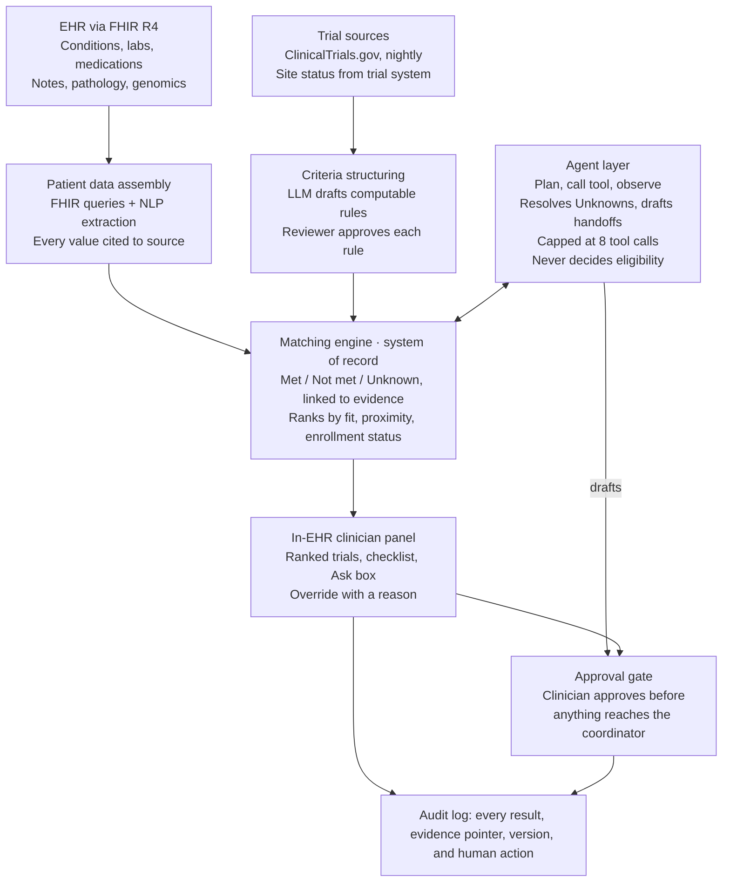

# Agentic Clinical Trial Matching — AI Product PRD

Oct 6, 2026 · Sankar Kumar Palaniappan · Status: Draft · Version 1.0

## 1. Problem (AI-Specific)

Eligible patients are routinely missed because matching a chart to a trial is manual, one patient and one trial at a time, against 20 to 50 free-text criteria.

- **Problem:** Criteria are written for humans: age, diagnosis and stage, biomarker status, labs within time windows, performance status, prior lines of therapy, organ function, and conflicting medications. The evidence is spread across structured EHR fields, pathology and genomic reports, imaging, and notes. Matching happens late, inconsistently, or not at all, often because the chart is incomplete.
- **Why AI (and not rules or manual review alone):** Two steps are language problems. Free-text criteria must become computable rules, and facts that live only in notes and PDFs must be extracted. When data is missing, the path to find it varies by patient, which suits an agent. The eligibility decision itself stays rules-based, so AI is bounded to extraction, evidence gathering, and explanation.
- **Status quo:** Research coordinators pre-screen clinic lists by hand. EHR queries catch coded fields but miss biomarkers buried in report PDFs. Screening often happens after the treatment decision, when the trial window has already closed.

## 2. User

The primary user is the treating oncologist at the point of care. The research coordinator owns the queue that follows.

| Persona | Job to be done | Where they work |
| --- | --- | --- |
| Treating oncologist | During a visit, know which open trials fit this patient, why, and what is missing, in under 2 minutes | Patient chart in the EHR |
| Clinical research coordinator | Work a prioritized queue of likely-eligible patients with evidence attached, not raw charts | Coordinator worklist |
| Principal investigator / trial team | Find patients for a specific trial that is under-enrolling | Trial-centric cohort view |
| Governance reviewers (AI, InfoSec, compliance) | Audit why the system made each call | Audit log and evidence links |

- **AI interaction pattern:** Suggest-and-approve copilot. The engine computes eligibility, the agent gathers evidence and drafts actions, and the clinician approves anything that leaves the system.
- **Trust requirements:** High. Every Met links to its source, every Unknown is explicit, and no referral or outreach is sent without clinician approval. Output is a screening aid; formal eligibility is still confirmed by the trial team per protocol.

## 3. Core Metric

**North Star:** coordinator-confirmed eligible matches per month in pilot trials, target +30% over the manual baseline within 6 months of pilot launch, with criterion-level accuracy held at 95% or higher.

Baselines are measured during the shadow-mode phase, when coordinators screen as usual and the system runs alongside them.

| Leading indicator | Baseline | Target |
| --- | --- | --- |
| Criterion-level accuracy (Met / Not met vs. adjudicated label) | Measured in shadow mode | ≥ 95% |
| Eligible trials appearing in the top 5 ranked (recall@5) | Measured in shadow mode | ≥ 90% |
| Met results with a valid, verifiable citation | n/a (new) | 100% |
| Unknowns resolved by the agent from existing chart data | n/a (new) | ≥ 40% |
| Coordinator screening time per patient | Manual time study | −50% |
| Clinician override rate on criterion results | Measured in pilot | < 10%, trending down |

## 4. MVP Features

The MVP ships the deterministic engine and clinician review first; agentic features layer on once the engine is validated.

| Feature | Priority | Description |
| --- | --- | --- |
| Trial ingestion | P0 | Pull open trials from ClinicalTrials.gov plus site, phase, and enrollment status from the institution's trial management system |
| Criteria structuring with review | P0 | LLM parses each free-text criterion into a computable rule (e.g., eGFR ≥ 60 within 28 days); a reviewer approves before it goes live |
| Patient data assembly | P0 | FHIR for coded data (conditions, observations, medications, diagnostic reports); NLP extraction for notes and pathology reports |
| Per-criterion evaluation | P0 | Every criterion scored Met, Not met, or Unknown, each linked to the exact note, lab, or report |
| Ranked recommendations | P0 | Eligible and near-eligible trials ordered by clinical fit, site proximity, and enrollment status |
| Clinician review and override | P0 | In-EHR panel to inspect evidence, override a criterion with a reason, or dismiss a trial |
| Audit log | P0 | Append-only record of every result, its evidence, versions used, and every human action |
| Agentic unknown resolution | P1 | Agent searches notes and reports for missing values (e.g., PD-L1), then re-runs the match |
| Coordinator handoff drafting | P1 | Agent drafts a referral to the coordinator; nothing is sent without clinician approval |
| Trial-centric cohort pre-screen | P1 | For one trial, list likely-eligible patients for the coordinator queue |
| Continuous monitoring | P2 | Re-screen patients when a new trial opens or a new lab or report arrives |

## 5. Constraints

The hardest constraints are data completeness and governance, not model capability.

- **Technical:** Engine-only results return in under 10 seconds at P95; a full agentic run completes in under 90 seconds. EHR FHIR APIs are rate-limited, so queries are batched and cached. Long charts exceed a single context window, so notes are chunked and retrieved per criterion. The app launches inside the EHR via SMART on FHIR.
- **Data:** FHIR R4 covers Condition, Observation, MedicationRequest, Procedure, and DiagnosticReport. Pathology and genomic results often arrive as PDFs or scans needing OCR, and some live only in external lab portals. ClinicalTrials.gov criteria vary in quality, and site-level open status depends on the institution's trial management system.
- **Regulatory and compliance:** PHI stays in the institution's cloud tenant under a BAA with the model provider, with no PHI used for model training. Pre-screening follows institutional IRB policy and HIPAA research provisions; patients are contacted only through their treating clinician. The design lets clinicians independently review the basis of every recommendation, supporting a non-device clinical decision support position, to be confirmed with regulatory.
- **Governance:** Releases pass formal review by AI governance, Cloud, InfoSec, Cyber, and the EHR team.
- **Organizational:** One pod: PM, 3 to 4 engineers, 1 ML engineer, 1 clinical informaticist, and part-time design, with coordinator SMEs on call. The pilot covers one disease group and 10 to 20 open trials.

## 6. Grounding Strategy

The model never reasons from memory: every fact comes from the patient's own record or the trial's own protocol, through tools.

- **Source of truth:** Patient data comes from the EHR (FHIR resources plus the document store for notes and reports). Trial data comes from ClinicalTrials.gov and the institution's trial management system. Eligibility logic lives in the reviewed criteria library, not in prompts.
- **Retrieval approach:** Tool calling rather than open-ended RAG. Coded data is queried directly through FHIR. Notes are retrieved with hybrid search (keyword plus embeddings), scoped to one patient and one criterion. The LLM extracts values into a fixed JSON schema. No fine-tuning in the MVP.
- **Freshness:** Trials sync nightly. Patient data is fetched live at query time. Lab time windows are evaluated against the query date, so a 40-day-old creatinine fails a 28-day criterion.
- **Citation and traceability:** Each criterion result stores an evidence pointer: FHIR resource type, ID, and date, or document ID plus text span. The UI deep-links to it. A criterion cannot be Met without a citation.

## 7. Hallucination Guardrails

The main guardrail is architectural: the LLM extracts and explains, but the rules engine decides eligibility.

- **Detection:** Every extracted value is checked deterministically against its cited text span; a value not found in the source is rejected. A secondary verifier model reviews low-confidence extractions. Conflicting sources (e.g., two different PD-L1 results) are flagged rather than resolved silently.
- **Prevention:** Structured output schemas for every extraction. Rationale is generated only from the engine's evaluated criteria, never free-form. Agent tools are read-only, except draft actions that wait for approval. Each agent run is capped at 8 tool calls.
- **Fallback:** When evidence is missing, the result is Unknown, with the step that would resolve it. When sources conflict, the result is Needs review. If the agent or a model call fails, the system shows engine-only results, never partial guesses.
- **User-facing signals:** Three-state chips (Met, Not met, Unknown); a confidence label on each extracted value; a conflicting-sources banner; and the evidence date, with stale results flagged.

## 8. Cost Budget

The pilot runs under a ceiling of about $5,000 per month in model spend. These are planning estimates, to be replaced with measured costs from shadow mode.

| Workload | Volume assumption | Target cost per unit | Monthly estimate |
| --- | --- | --- | --- |
| Point-of-care match (patient-centric) | ~200 queries per day, 22 clinic days | ≤ $0.50 per run | ~$2,200 |
| Nightly re-screen (P2) | ~5,000 active patients, ~10% with new data each night | ≤ $0.05 per patient | ~$750 |
| Criteria parsing | Once per trial version, 10 to 20 trials | ≤ $2 per trial | < $50 |

- **Model tiers:** A small, fast model handles extraction and classification at volume. A larger reasoning model handles agent planning and one-time criteria parsing, where quality matters more than cost.
- **Cost controls:** A deterministic pre-filter (disease, stage, trial status) runs before any LLM call. Patient extractions are cached per data version and invalidated when new documents arrive. Each agent run has a token budget and the 8-call cap.

## 9. Eval Strategy

No prompt, model, or rule change ships unless the offline suite passes; online evals then confirm behavior on real charts.

- **Offline evals:** A golden set of 200 patient-trial pairs from the pilot disease, labeled at the criterion level by two coordinators and adjudicated by an oncologist. It deliberately includes incomplete charts. Public benchmarks (TREC Clinical Trials, n2c2 2018 cohort selection) are used for regression. Criteria parsing is scored against rules written by hand.
- **Online evals:** Shadow mode first: the system runs while coordinators screen as usual, and results are compared. Then human-in-the-loop, with every recommendation adjudicated. In steady state, 5% of results are double-reviewed weekly, and override reasons are captured.
- **Cadence:** Full offline suite on every change, as a CI gate. Weekly online sample review. Quarterly re-baselining as trials open and close.

| Metric | Level | Ship threshold |
| --- | --- | --- |
| Criterion accuracy (Met / Not met) | Criterion | ≥ 95% |
| Appropriate Unknown (evidence truly absent) | Criterion | ≥ 90% |
| Citation validity | Criterion | 100% |
| Extraction accuracy for key fields (PD-L1, ECOG, eGFR, stage) | Field | ≥ 95% each |
| Recall@5 of eligible trials | Trial | ≥ 90% |
| Agent task success (unknown resolved correctly) | Agent | ≥ 85% |
| Performance gap across age, sex, race/ethnicity, and language subgroups | Equity | ≤ 5 points |
| Latency P95 (engine / agent) | System | 10 s / 90 s |

## 10. Production Readiness

Every result is stamped with the model, prompt, and rule-set versions that produced it, so any regression can be traced and reversed.

- **Monitoring:** Latency, error rate, FHIR failures, and cost per run. Unknown rate by criterion, where a spike signals an extraction regression. Override rate, citation-check failures, and subgroup performance.
- **Rollback plan:** Prompts, models, and rule sets are versioned. Feature flags fall back to engine-only (no agent) or to the previous version. Affected results are re-run and flagged to coordinators.
- **Rate limiting and abuse prevention:** Per-user query limits, an agent step cap, and a token budget per run. Access is limited to patients with a treating relationship, following the EHR's existing access rules.

**Launch checklist**

- [ ] AI governance review approved
- [ ] InfoSec and Cyber review passed, including a penetration test and PHI data-flow review
- [ ] Cloud architecture review passed
- [ ] EHR team integration approval
- [ ] IRB determination for the pre-screening workflow
- [ ] All offline eval thresholds met
- [ ] Clinicians and coordinators trained
- [ ] On-call rotation and downtime procedure in place

## 11. Engineering Context

The matching engine is the system of record; the agent is a client of it, never a replacement.

Data flows down from the EHR and trial sources into the engine. Questions from the Ask box start agent runs, and anything the agent drafts waits at the approval gate.

- **Key integrations:** EHR FHIR R4 APIs and SMART on FHIR launch, the EHR document store, the ClinicalTrials.gov API, the institution's trial management system, and an LLM provider under a BAA.
- **Team and ownership:** Data engineering owns ingestion. ML engineering owns extraction, criteria parsing, and the agent. Backend owns the engine and audit log. Clinical informatics owns the criteria library. The EHR team owns integration approval.
- **Dependencies not yet in place:** FHIR API access and app registration, a trial-system API for site status, OCR for scanned reports, an event feed for new results (needed for monitoring), and the BAA-covered model endpoint.

## 12. Product Intelligence

Every clinician override is treated as a labeled data point that routes to a specific fix.

- **Usage analytics:** Queries per clinician, time spent in review, which criteria are opened, referral drafts approved, edited, or rejected, and who resolved each Unknown (agent or human).
- **Feedback loop:** Overrides carry a reason code: wrong value, wrong source, outdated evidence, or wrong rule. Extraction errors go to the ML backlog, rule errors to the informaticist, and confirmed cases into the golden set. There is no automatic retraining on PHI in the MVP.
- **Personalization:** Minimal by design, to keep behavior consistent for governance: a default disease filter by specialty and saved trial watchlists. There is no per-user model adaptation.
- **Competitive signal:** Epic's [Life Sciences program](https://epic.com/epic/post/epic-launches-life-sciences-program-unifying-clinical-research-with-care-delivery) offers native trial matchmaking. Oncology vendors such as [Tempus (with Deep 6 AI) and Triomics](https://resources.rework.com/tools/ai-tools/best-ai-tools-for-clinical-trial-recruitment-2026) and platforms like [Paradigm Health](https://news.ochsner.org/news-releases/ochsner-health-and-paradigm-health-expand-access-to-clinical-trials-across-the-gulf-south/) are scaling across health systems. Microsoft offers a [Trial Matcher API](https://learn.microsoft.com/azure/azure-health-insights/overview). The differentiation here: per-criterion citations, Unknown as a first-class result, and agentic evidence gathering behind approval gates.

## 13. Design & UX

The experience lives inside the patient chart, so clinicians never leave the EHR to check trials.

- **Interaction model:** An embedded EHR panel with three views: a ranked trial list, a per-trial criterion checklist with evidence links, and an "Ask" box for agent questions such as "Any lung cancer trials for this patient?" Coordinators get a separate worklist of likely-eligible patients.
- **Loading and latency:** Engine results appear first. Agent enrichment updates rows in place with a live status ("Checking pathology reports for PD-L1"). The panel never blocks while the agent runs.
- **Error and uncertainty states:** Unknown chips show the next step ("Locate or order PD-L1 IHC"). Conflicting sources show a banner listing both values. Stale evidence shows its date. If the system is unavailable, it says so and shows no partial results.
- **Edit and override:** Clinicians can set any criterion to Met or Not met with a reason, dismiss a trial with a reason, and edit a drafted referral before approving it. Every action is logged.

## 14. Technical Implementation Framework (Next.js)

A Next.js app serves the in-EHR panel and API; long-running jobs run in a separate worker, outside the web runtime.

- **Frontend:** App Router. SMART on FHIR launch routes (`/launch`, `/callback`) receive patient context from the EHR. `/patient/[id]/trials` uses server components for the ranked list. The interactive checklist and Ask box render client-side. `/worklist` serves coordinators, and `/admin/criteria` handles rule review.
- **API layer:** Route handlers: `/api/match` (synchronous engine run), `/api/agent` (streamed agent progress via server-sent events), and `/api/criteria` (rule review). Trial sync and nightly re-screen run on a queue worker.
- **Model integration:** An LLM provider under a BAA inside the institution's cloud (for example, Claude through Amazon Bedrock). It uses tool calling for the agent, structured outputs for extraction, and streaming to the UI.
- **State and data:** Postgres for trials, rules, results, and an append-only audit log. pgvector for per-patient note chunks, with a time-to-live. Redis for caching. React Query for client state.
- **Deployment:** Runs in the institution's private cloud network, with private connectivity to the FHIR endpoint and secrets in a managed key store. No PHI in application logs. Environments: dev (synthetic Synthea data), staging (de-identified data), prod.

## 15. Feature-Wise Build Plan

The engine reaches shadow mode by week 14; agentic features follow only after the engine passes its eval thresholds. Weeks are counted from build kickoff.

| Feature | Phase | Owner | Target | Dependencies |
| --- | --- | --- | --- | --- |
| Trial ingestion | Phase 1 | Data engineering | Week 4 | ClinicalTrials.gov API, trial management system access |
| Criteria structuring and review tool | Phase 1 | ML engineering + clinical informatics | Week 6 | Rule format agreed with informatics |
| FHIR patient data assembly | Phase 1 | Integration engineering + EHR team | Week 6 | FHIR API access, SMART app registration |
| Per-criterion evaluation engine | Phase 1 | Backend engineering | Week 8 | Criteria library, patient data assembly |
| Golden set v1 (200 pairs) | Phase 1 | PM + coordinators | Week 8 | IRB determination, coordinator time |
| NLP extraction from notes and reports | Phase 2 | ML engineering | Week 11 | Document store access, OCR for scanned reports |
| Ranking and in-EHR clinician panel | Phase 2 | Frontend + design | Week 12 | Engine, SMART launch |
| Audit log and shadow mode | Phase 2 | Backend engineering | Week 14 | InfoSec and AI governance review |
| Agentic unknown resolution | Phase 3 | ML engineering | Week 18 | Engine passing eval thresholds |
| Coordinator handoff drafting | Phase 3 | Backend + frontend | Week 20 | Approval-gate design sign-off |
| Trial-centric cohort pre-screen | Phase 3 | Backend engineering | Week 20 | Coordinator worklist |
| Continuous monitoring | Phase 4 | Data engineering | Week 26 | Event feed for new labs and reports |

## Open Questions

- [ ] Which disease group pilots first, and how many trials are open in it?
- [ ] Does the trial management system expose site-level enrollment status through an API?
- [ ] Where do genomic results land: discrete EHR results, PDFs, or an external lab portal?
- [ ] Does pre-screening fall under existing IRB policy, or does it need its own determination?
- [ ] Who signs off on each structured rule: the coordinator, the PI, or clinical informatics?
- [ ] Does regulatory agree with the non-device clinical decision support position?
- [ ] Which LLM provider already has a BAA in place with the institution?

## Assumptions Made

- Provider-side deployment at an academic cancer center running Epic with FHIR R4 APIs.
- Pilot in thoracic oncology with 10 to 20 open trials, about 50 clinicians, and about 200 queries per day.
- Targets are proposals; baselines are measured during shadow mode.
- Cost figures are planning estimates, not vendor quotes.
- One pod is staffed as described in Constraints.
- Next.js follows this PRD template; the final stack follows platform standards.
